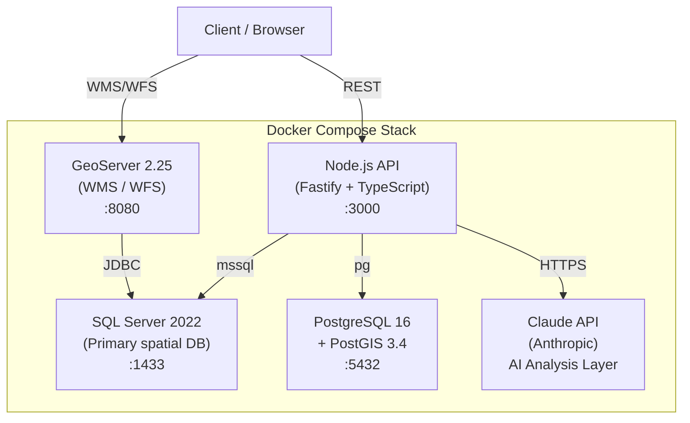

# POC GeoServer + SQL Server

[](https://github.com/your-username/poc-geoserver-sqlserver/actions/workflows/ci.yml)
[](./LICENSE)
[](./docker-compose.yml)
[](./api)

> Educational POC demonstrating production-grade geospatial engineering: GeoServer, SQL Server 2022, PostGIS 3.4, spatial validation, AI-powered analysis, and benchmark-driven decision making — all containerized and reproducible.

---

## Architecture



---

## Quickstart

```bash
# 1. Clone
git clone https://github.com/your-username/poc-geoserver-sqlserver.git
cd poc-geoserver-sqlserver

# 2. Configure environment
cp .env.example .env
# Edit .env — set SA_PASSWORD and ANTHROPIC_API_KEY

# 3. Start the full stack (first run pulls images + seeds data)
docker compose up --build

# 4. Run spatial inconsistency validation
curl http://localhost:3000/inconsistencias

# 5. Run all 15 benchmark scenarios
curl -X POST http://localhost:3000/benchmark/run
```

> **GeoServer Layer Preview**: http://localhost:8080/geoserver/web → Layer Preview

---

## What This POC Demonstrates

### Geospatial Engineering
- Spatial indexing strategies (R-tree / GIST) and their performance implications at different volumetries
- Geographic inconsistency detection using SQL spatial functions (`STIntersects`, `STDistance`, `STIsValid`)
- GeoServer WMS/WFS configuration including resolution of the **undocumented bbox bug** with SQL Server JDBC (see [docs/03-setup-geoserver.md](docs/03-setup-geoserver.md))
- Schema design for 50k+ points, 100k+ lines, and 2k polygons with spatial indexes

### AI-Driven Engineering
- Claude API integration for intelligent spatial anomaly analysis (structured JSON output)
- Prompt engineering with typed schemas — production-ready, not just demos
- AI-assisted benchmark interpretation and query optimization suggestions
- Automated PR review via GitHub Actions using Claude API
- Full `.claude/` setup: multi-agent workflow (PO, QA, Infra, Reviewer, GIS Expert)

### Architecture & Decision-Making
- 5 Architecture Decision Records (ADRs) documenting non-obvious tradeoffs
- Volumetry analysis: how design decisions evolve from 50k to 50M features
- Cost modeling: when open-source beats proprietary at scale
- Spec-driven development: every feature starts with a written spec

### Observability & Benchmarking
- 15 parameterized benchmark scenarios with p50/p95/p99 and throughput metrics
- Side-by-side SQL Server vs PostGIS comparison on identical datasets
- AI-generated insights layered on raw benchmark data

---

## Benchmark Results

> Generated by `/project:benchmark` — see [benchmark/results/](benchmark/results/) for full data.

| Scenario | SQL Server p95 | PostGIS p95 | Winner |
|----------|---------------|-------------|--------|
| B01: Bbox dense region | — | — | TBD |
| B07: JOIN pole ↔ line | — | — | TBD |
| B15: Full validation scan | — | — | TBD |

*Results populated after first `docker compose up` + benchmark run.*

---

## Project Structure

```
poc-geoserver-sqlserver/
├── .claude/                 # Claude Code: agents, commands, hooks
│   ├── CLAUDE.md            # Project context loaded in every AI session
│   ├── agents/              # Role-based AI personas (PO, QA, Infra, ...)
│   └── commands/            # Slash commands (/project:review, /project:deploy, ...)
├── .github/                 # GitHub Actions, PR template, issue templates
├── specs/                   # All specifications (written before implementation)
├── docs/
│   ├── adr/                 # Architecture Decision Records
│   └── *.md                 # Detailed technical docs (PT-BR)
├── sqlserver/               # SQL Server schema, seed scripts, views
├── postgis/                 # PostGIS equivalent schemas
├── geoserver/data_dir/      # GeoServer workspace pre-configuration
├── api/                     # Node.js 20 / Fastify API + AI layer
├── benchmark/               # Scenarios, runner, results
├── docker-compose.yml
└── .env.example
```

---

## AI-Driven Development Workflow

This project uses Claude Code with a custom multi-agent setup simulating a real engineering team. Each agent has domain-specific instructions and is invoked at the right moment in the workflow.

| Agent | Role | Triggered When |
|-------|------|----------------|
| PO Agent | Scope, acceptance criteria, issue tracking | Sprint planning, spec review |
| QA Agent | Edge cases, idempotency, API contracts | Before any PR merge |
| Infra Agent | Docker, CI/CD, secrets, health checks | Infrastructure changes |
| Reviewer Agent | Security, performance, conventions | Every code PR |
| GIS Expert | Spatial correctness, SRID, GeoServer | Spatial SQL, config changes |

```bash
/project:review          # Full code review before PR
/project:deploy          # Interactive deploy checklist
/project:benchmark       # Run all 15 benchmark scenarios
/project:validate        # Spatial inconsistency report + AI analysis
/project:new-adr         # Scaffold a new Architecture Decision Record
/project:sprint-status   # Check progress against open GitHub issues
/project:qa              # Full QA checklist before release
```

---

## Documentation

| Doc | Description |
|-----|-------------|
| [specs/00-prd.md](specs/00-prd.md) | Product Requirements Document |
| [specs/01-technical-spec.md](specs/01-technical-spec.md) | Technical architecture spec |
| [specs/02-api-spec.md](specs/02-api-spec.md) | API contract (OpenAPI) |
| [docs/adr/001-sql-server-vs-postgis.md](docs/adr/001-sql-server-vs-postgis.md) | ADR: Why both databases? |
| [docs/01-arquitetura.md](docs/01-arquitetura.md) | Architecture deep-dive (PT-BR) |
| [docs/04-validacao-inconsistencias.md](docs/04-validacao-inconsistencias.md) | Spatial validation rules (PT-BR) |
| [docs/05-benchmark.md](docs/05-benchmark.md) | Benchmark methodology (PT-BR) |
| [docs/08-volumetria-tradeoffs.md](docs/08-volumetria-tradeoffs.md) | Volumetry tradeoffs (PT-BR) |

---

## Origin

This is an educational POC inspired by real-world geospatial engineering challenges encountered when working with utility network data. All data is 100% synthetic — no proprietary or client data is included. The project exists to demonstrate technical competencies, document real gotchas (like the GeoServer bbox bug), and serve as a reference for teams evaluating SQL Server vs PostGIS for spatial workloads.

---

## License

[MIT](./LICENSE) — free to use, fork, and learn from.
