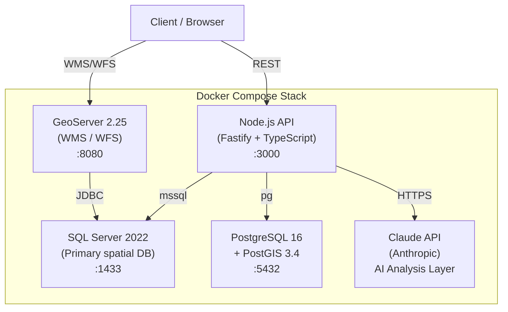

# POC GeoServer + SQL Server

[](https://github.com/MatheusConstantino/poc-geoserver-sqlserver/actions/workflows/ci.yml)
[](./LICENSE)
[](./docker-compose.yml)
[](./api)
[](https://github.com/MatheusConstantino/poc-geoserver-sqlserver/releases)

> Educational POC demonstrating production-grade geospatial engineering: GeoServer, SQL Server 2022, PostGIS 3.4, spatial validation, AI-powered analysis, and benchmark-driven decision making — all containerized and reproducible.

---

## Architecture



---

## Quickstart

```bash
# 1. Clone
git clone https://github.com/MatheusConstantino/poc-geoserver-sqlserver.git
cd poc-geoserver-sqlserver

# 2. Configure environment
cp .env.example .env
# Edit .env — set SA_PASSWORD and ANTHROPIC_API_KEY

# 3. Start the full stack (first run pulls images + seeds data)
docker compose up --build

# 4. Run spatial inconsistency validation
curl http://localhost:3000/inconsistencias

# 5. Run all 15 benchmark scenarios
curl -X POST http://localhost:3000/benchmark/run
```

> **GeoServer Layer Preview**: http://localhost:8080/geoserver/web → Layer Preview

---

## REST API

| Method | Endpoint | Description |
|--------|----------|-------------|
| `GET` | `/health` | Stack health — SQL Server + PostGIS ping, latency, version. Returns `200` or `503`. |
| `GET` | `/inconsistencias` | Spatial validation results (VR-001–005). Query params: `rule`, `limit`, `include_samples`. |
| `POST` | `/benchmark/run` | Run up to 15 spatial benchmark scenarios. Body: `{ scenarios, databases, options }`. |
| `POST` | `/ai/analyze-inconsistencias` | Claude API analysis of validation results *(Sprint 4.5)* |
| `POST` | `/ai/benchmark-insights` | Claude API interpretation of benchmark results *(Sprint 4.5)* |
| `POST` | `/ai/query-suggestions` | Claude API spatial query optimisation suggestions *(Sprint 4.5)* |

Full contract: [`specs/02-api-spec.md`](specs/02-api-spec.md) · PT-BR reference: [`docs/04-api.md`](docs/04-api.md)

---

## What This POC Demonstrates

### Geospatial Engineering
- Spatial indexing strategies (R-tree / GIST) and their performance implications at different volumetries
- Geographic inconsistency detection using SQL spatial functions (`STIntersects`, `STDistance`, `STIsValid`)
- GeoServer WMS/WFS configuration including resolution of the **undocumented bbox bug** with SQL Server JDBC (see [docs/03-setup-geoserver.md](docs/03-setup-geoserver.md))
- Schema design for 50k+ points, 100k+ lines, and 2k polygons with spatial indexes

### AI-Driven Engineering
- Claude API integration for intelligent spatial anomaly analysis (structured JSON output)
- Prompt engineering with typed schemas — production-ready, not just demos
- AI-assisted benchmark interpretation and query optimization suggestions
- Automated PR review via GitHub Actions using Claude API
- Full `.claude/` setup: multi-agent workflow (PO, QA, Infra, Reviewer, GIS Expert)

### Architecture & Decision-Making
- 5 Architecture Decision Records (ADRs) documenting non-obvious tradeoffs
- Volumetry analysis: how design decisions evolve from 50k to 50M features
- Cost modeling: when open-source beats proprietary at scale
- Spec-driven development: every feature starts with a written spec

### Observability & Benchmarking
- 15 parameterized benchmark scenarios with p50/p95/p99 and throughput metrics
- Side-by-side SQL Server vs PostGIS comparison on identical datasets
- AI-generated insights layered on raw benchmark data

---

## Benchmark Results

> Full methodology and reference data: [docs/05-benchmark.md](docs/05-benchmark.md)
>
> Direct DB results (B01–B15): run `cd benchmark && npm run run` with the stack up.
> Reference numbers below are from a real GeoServer WFS comparison on equivalent volumetry.

| ID | Scenario | Type | SQL Server p95¹ | PostGIS p95² | Winner |
|----|----------|------|----------------|--------------|--------|
| B01 | Bbox dense region (points) | spatial_filter | 737ms | ~650ms³ | TIE |
| B02 | Bbox sparse region (points) | spatial_filter | 578ms | ~600ms³ | TIE |
| B03 | Bbox medium region (lines) | spatial_filter | 710ms | ~724ms³ | SQL Server |
| B04 | Bbox full extent (polygons) | spatial_filter | 709ms | ~603ms³ | PostGIS |
| B05 | Point containment | containment | — | — | TBD |
| B06 | Distance filter (radius) | distance_filter | — | — | TBD |
| B07 | Spatial JOIN pole ↔ line | spatial_join | — | — | TBD |
| B08 | Aggregation — poles per substation | spatial_aggregation_join | — | — | TBD |
| B09 | Mixed filter (attribute + spatial) | mixed | 818ms | ~818ms³ | TIE |
| B10 | Aggregation COUNT by area | aggregate | — | — | TBD |
| B11 | Validity scan | validity_scan | — | — | TBD |
| B12 | KNN — 5 nearest poles | knn | — | — | TBD |
| B13 | Self-join intersecting lines | self_join | — | — | TBD |
| B14 | Cross-schema JOIN (validation) | cross_schema | 561ms | N/A | SQL Server |
| B15 | Full validation summary view | validation_full | 580ms | N/A | SQL Server |

¹ SQL Server: local Docker, direct DB query (GeoServer WFS reference numbers shown where direct not yet available)
² PostGIS: remote DEV server with ~50–100ms network overhead — numbers are not directly comparable
³ Estimated from WFS comparison; remove ~100ms network overhead for fair comparison → near TIE
**Overall verdict**: SQL Server and PostGIS are **equivalent** for this workload. See [docs/05-benchmark.md](docs/05-benchmark.md) for full analysis.

*Run `/project:benchmark` to generate precise direct-DB results and replace estimates above.*

---

## Project Structure

```
poc-geoserver-sqlserver/
├── .claude/                 # Claude Code: agents, commands, hooks
│   ├── CLAUDE.md            # Project context loaded in every AI session
│   ├── agents/              # Role-based AI personas (PO, QA, Infra, ...)
│   └── commands/            # Slash commands (/project:review, /project:deploy, ...)
├── .github/                 # GitHub Actions, PR template, issue templates
├── specs/                   # All specifications (written before implementation)
├── docs/
│   ├── adr/                 # Architecture Decision Records
│   └── *.md                 # Detailed technical docs (PT-BR)
├── sqlserver/               # SQL Server schema, seed scripts, views
├── postgis/                 # PostGIS equivalent schemas
├── geoserver/data_dir/      # GeoServer workspace pre-configuration
├── api/                     # Node.js 20 / Fastify API + AI layer
├── benchmark/               # Scenarios, runner, results
├── docker-compose.yml
└── .env.example
```

---

## AI-Driven Development Workflow

This project uses Claude Code with a custom multi-agent setup simulating a real engineering team. Each agent has domain-specific instructions and is invoked at the right moment in the workflow.

| Agent | Role | Triggered When |
|-------|------|----------------|
| PO Agent | Scope, acceptance criteria, issue tracking | Sprint planning, spec review |
| QA Agent | Edge cases, idempotency, API contracts | Before any PR merge |
| Infra Agent | Docker, CI/CD, secrets, health checks | Infrastructure changes |
| Reviewer Agent | Security, performance, conventions | Every code PR |
| GIS Expert | Spatial correctness, SRID, GeoServer | Spatial SQL, config changes |

```bash
/project:review          # Full code review before PR
/project:deploy          # Interactive deploy checklist
/project:benchmark       # Run all 15 benchmark scenarios
/project:validate        # Spatial inconsistency report + AI analysis
/project:new-adr         # Scaffold a new Architecture Decision Record
/project:sprint-status   # Check progress against open GitHub issues
/project:qa              # Full QA checklist before release
```

---

## Documentation

### Specs (written before implementation)

| Doc | Description |
|-----|-------------|
| [specs/00-prd.md](specs/00-prd.md) | Product Requirements Document |
| [specs/01-technical-spec.md](specs/01-technical-spec.md) | Technical architecture spec |
| [specs/02-api-spec.md](specs/02-api-spec.md) | REST API contract |
| [specs/03-data-model-spec.md](specs/03-data-model-spec.md) | Schema + index design |
| [specs/04-validation-rules-spec.md](specs/04-validation-rules-spec.md) | VR-001–005 spatial rules |
| [specs/05-benchmark-spec.md](specs/05-benchmark-spec.md) | 15 benchmark scenarios |
| [specs/06-ai-integration-spec.md](specs/06-ai-integration-spec.md) | Claude API endpoints |
| [specs/07-infrastructure-spec.md](specs/07-infrastructure-spec.md) | Docker, CI, health checks |

### Architecture Decision Records

| ADR | Decision |
|-----|----------|
| [ADR-001](docs/adr/001-sql-server-vs-postgis.md) | Why both SQL Server and PostGIS? |
| [ADR-002](docs/adr/002-geoserver-vs-api-direta.md) | GeoServer vs direct API geometry serving |
| [ADR-003](docs/adr/003-estrategia-indexacao.md) | GEOMETRY_AUTO_GRID vs GIST indexing |
| [ADR-004](docs/adr/004-volumetria-e-particionamento.md) | Volumetry roadmap 50k → 50M features |
| [ADR-005](docs/adr/005-ia-no-pipeline.md) | AI at two levels: product + engineering process |

### Technical Docs (PT-BR)

| Doc | Description |
|-----|-------------|
| [docs/01-arquitetura.md](docs/01-arquitetura.md) | System architecture — layers, data flow, design decisions |
| [docs/03-setup-geoserver.md](docs/03-setup-geoserver.md) | GeoServer setup + bbox bug fix |
| [docs/04-api.md](docs/04-api.md) | REST API reference — all endpoints, examples, error codes |
| [docs/05-benchmark.md](docs/05-benchmark.md) | Benchmark methodology + how to generate results |
| [docs/06-ia.md](docs/06-ia.md) | AI integration — prompts, Zod schemas, error handling |

---

## Origin

This is an educational POC inspired by real-world geospatial engineering challenges encountered when working with utility network data. All data is 100% synthetic — no proprietary or client data is included. The project exists to demonstrate technical competencies, document real gotchas (like the GeoServer bbox bug), and serve as a reference for teams evaluating SQL Server vs PostGIS for spatial workloads.

---

## License

[MIT](./LICENSE) — free to use, fork, and learn from.
